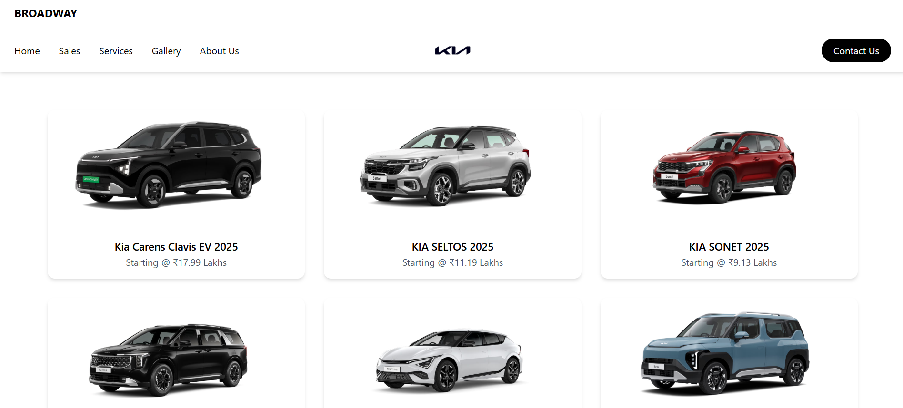
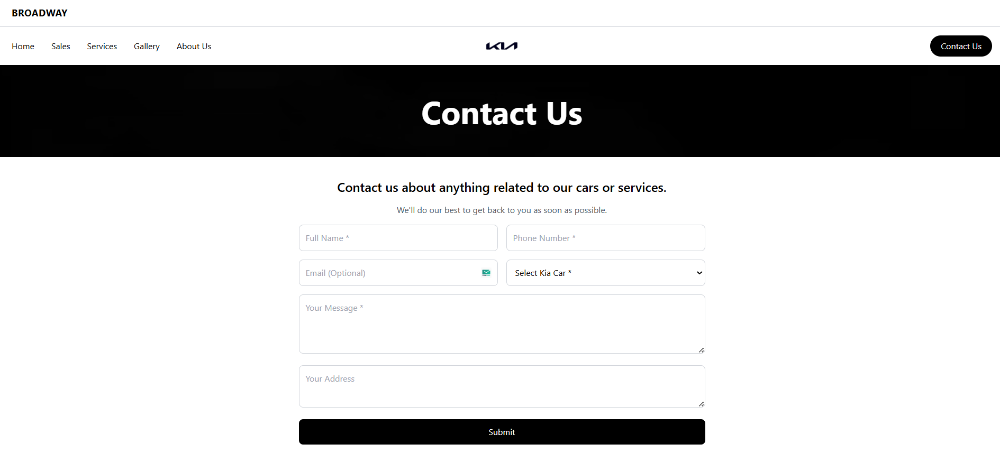

# Broadway-Kia

A fully responsive React + Tailwind CSS website built with a clean, modern UI and smooth performance.  
The project includes reusable components, animations, routing, and optimized styling.  
Designed to work across all devices with a structured and maintainable codebase.

---

## 📸 Screenshots

  





---

## 🚀 Features

- Responsive UI using Tailwind CSS
- Modern layout with clean component structure
- Smooth animations via Framer Motion
- Icon system using lucide-react and react-icons
- Masonry layout using react-masonry-css
- Routing with React Router DOM
- Fast dev environment powered by Vite

---

## 📦 Tech Stack

**Frontend:** React, Tailwind CSS, Framer Motion, React Icons, Lucide React, React Router DOM, React Masonry CSS  
**Tooling:** Vite, ESLint, PostCSS, Autoprefixer

---

## 📁 Project Structure

```

src/
├── components/
├── pages/
├── assets/
├── hooks/
├── App.jsx
├── main.jsx
└── index.css

```

---

## 🛠 Installation & Setup

```bash
# Clone the repository
git clone https://github.com/your-username/broadway-kia.git

# Navigate to project folder
cd broadway-kia

# Install dependencies
npm install

# Start development server
npm run dev
```

---

## 📦 Build for Production

```bash
npm run build
```

Build output will be inside the `dist/` folder.

---

## 🌐 Live Demo

[https://broadway-kia.netlify.app](https://broadway-kia.netlify.app)

---

## 🔧 Dependencies

```json
"dependencies": {
  "framer-motion": "^12.23.24",
  "lucide-react": "^0.544.0",
  "react": "^18.3.1",
  "react-dom": "^18.3.1",
  "react-icons": "^5.5.0",
  "react-masonry-css": "^1.0.16",
  "react-router-dom": "^7.9.1"
},
"devDependencies": {
  "@eslint/js": "^9.33.0",
  "@types/react": "^19.1.10",
  "@types/react-dom": "^19.1.7",
  "@vitejs/plugin-react": "^5.0.2",
  "autoprefixer": "^10.4.21",
  "eslint": "^9.33.0",
  "eslint-plugin-react-hooks": "^5.2.0",
  "eslint-plugin-react-refresh": "^0.4.20",
  "globals": "^16.3.0",
  "postcss": "^8.5.6",
  "tailwindcss": "^3.4.17",
  "vite": "^7.1.2"
}
```

---

## ✨ Author

**Mohammad Kaif**
Frontend Developer | React | Tailwind | JavaScript

---
